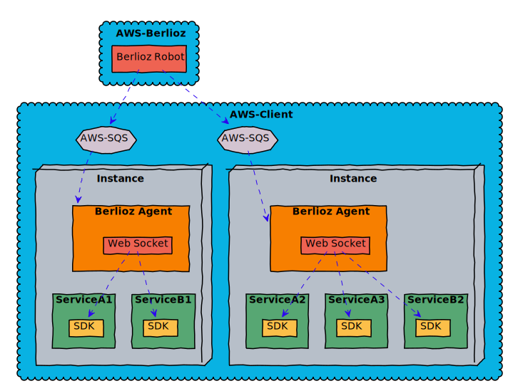

[](https://github.com/igrigorik/ga-beacon)

# Connectors

## Purpose
The connector provides service mesh functionality across microservices, as well
as between microservice to AWS native service communications. It comes in a form of a client library which is linked to the microservice. For the full list of connectors see [implementations](#implementations).


## Architecture


* **AWS-Client**: Client AWS cloud account where deployment is specified to happen.
* **Instance**: An AWS Instance.
* **Service[x][y]**: Running replica **y** of the **Service[x]**.
* **Connector**: A client library which is linked to the **Service[x]**.
* **Berlioz Agent**: An agent which is automatically deployed on every instance by the **Berlioz Robot**.
* **Web Socket**: The agent provides web socket for the connectors to listen to metadata and peer changes.
* **AWS-SQS**: A message queue service provided by AWS is used as a communication mechanism between **Berlioz Agent** and **Berlioz Robot**.
* **AWS-Berlioz**: Berlioz AWS cloud account.
* **Berlioz Robot**: A smart robot that performs deployment of clusters to client AWS account, along will all the resources in the diagram.

## Using The Connector
Connectors are implemented in different languages and language specifics may affect exact interface, but regardless the connectors provide following APIs to the microservice:

### Working With Peer Microservices

#### getPeers(kind, name, endpoints)
Returns the list of all peers for specified target.

**Parameters**:
* **kind**: is either _service_ or _cluster_
* **name**: name of the target service/cluster
* **endpoint**: name of the endpoint

**Returns:**
* **identity**: unique identifier of the peer
    * **address**: ip address of the peer
    * **port**: port of the peer

**Examples**:
```
berlioz.getPeers('service', 'app', 'client');
```
returns:
```
{
    '1': {
        address: '10.0.0.22',
        port: '1234'
    },
    '2': {
        address: '10.0.0.23',
        port: '5678'
    }
}
```

#### monitorPeers(kind, name, endpoints, cb)
Monitors for peers changes and triggers the provided callback with changes.

**Parameters**:
* **kind**: is either _service_ or _cluster_
* **name**: name of the target service/cluster
* **endpoint**: name of the endpoint
* **callback**: function(data). Called when peers change.
    * **data**: map of peers
        * **identity**: unique identifier of the peer
            * **address**: ip address of the peer
            * **port**: port of the peer


**Examples**:
```
berlioz.monitorPeers('service', 'app', 'client', (peers) => {
    console.log(peers);
});
```
outputs:
```
{
    '1': {
        address: '10.0.0.22',
        port: '1234'
    },
    '2': {
        address: '10.0.0.23',
        port: '5678'
    }
}
```

#### getRandomPeer(kind, name, endpoints)
Returns a random peer for specified target.

**Parameters**:
* **kind**: is either _service_ or _cluster_
* **name**: name of the target service/cluster
* **endpoint**: name of the endpoint

**Returns:**
* **address**: ip address of the peer
* **port**: port of the peer


**Examples**:
```
berlioz.getRandomPeer('service', 'app', 'client');
```
returns:
```
{
    address: '10.0.0.22',
    port: '1234'
}
```

#### request(kind, name, endpoints, options)
Sends a policy aware HTTP request to a random peer for specified target. Policies control retry, routing and tracing behavior.

**Parameters**:
* **kind**: is either _service_ or _cluster_
* **name**: name of the target service/cluster
* **endpoint**: name of the endpoint
* **options**: specify HTTP parameters. Include _method_, _url_ and _body_ attributes. Note that _url_ should be relative (i.e. not include server ip/port)

**Returns:**
Promise or other object/callback to get notified with response.

**Examples**:
```
berlioz.request('service', 'app', 'client', {
        url: '/contact',
        method: 'POST',
        body: {
            name: 'Chuck Norris',
            phone: '314-159-2653'
        }
    });
```

### Working With AWS Hosted Databases

#### getDatabaseInfo(name)
Returns database connection information.

**Parameters**:
* **name**: name of the database

**Returns**:
* **tableName**: the name of the AWS DynamoDB Table
* **config**: contains AWS connection information. Should be passed to AWS SDK constructor.

**Examples**:
```
berlioz.getDatabaseInfo('contacts');
```
returns:
```
{
    tableName: 'contacts',
    config: {}
}
```

#### getDatabaseClient(name, AWS)
Returns AWS SDK wrapper for the specified database. Follows policies for
retry and call tracing means.

**Parameters**:
* **name**: the name of the database
* **AWS**: AWS SDK to wrap

**Returns** wrapped AWS SDK object. In case of DynamoDB database creates
wrapped _AWS.DynamoDB.DocumentClient_. Wraps every method of _DocumentClient_ to provide retry, tracing, setting TableName and returning a Promise to get notified regarding operation completion.

**Examples**:
```
var docClient = berlioz.getDatabaseClient('contacts', AWS);
var params = {
    Item: {
        'name': 'Chuck Norris',
        'phone': '314-159-2653'
    }
};
docClient.put(params)
    .then(data => {
        console.log(data);
    })
```


### Working With AWS Hosted Queues

#### getQueueInfo(name)
Returns queue connection information.

**Parameters**:
* **name**: name of the queue

**Returns**:
* **streamName**: the name of the AWS Kinesis Stream
* **config**: contains AWS connection information. Should be passed to AWS SDK constructor.

**Examples**:
```
berlioz.getQueueInfo('jobs');
```
returns:
```
{
    streamName: 'contacts',
    config: {}
}
```

#### getQueueClient(name, AWS)
Returns AWS SDK wrapper for the specified queue. Follows policies for
retry and call tracing means.

**Parameters**:
* **name**: name of the queue
* **AWS**: AWS SDK to wrap

**Returns** wrapped AWS SDK object. In case of Kinesis queue creates
wrapped _AWS.Kinesis_. Wraps every method of _Kinesis_ to provide retry, tracing, setting StreamName and returning a Promise to get notified regarding operation completion.

**Examples**:
```
var kinesis = berlioz.getQueueClient('jobs', AWS);
var params = {
    PartitionKey: 'abcd',
    Data: {
        'name': 'do-something'
    }
};
kinesis.putRecord(params)
    .then(data => {
        console.log(data);
    })
```

## Implementations

### NodeJS Connector
* [NodeJS Connector](https://github.com/berlioz-the/connector-nodejs) - official NodeJS connector.

### Python Connector
* coming soon

## Developing New Connector
If the connector is not available in a particular language, its a pretty trivial task to implement in a language of your choice. There are few things that it has to do:
1. Connect to **Berlioz Agent** using web socket client and listen to changes. The **BERLIOZ_AGENT_PATH** environment variable specifies the web socket address.
2. Record changes received from the web socket in dictionaries.
3. Provide APIs from [here](#using-the-connector)
4. For tracing purposes report API usage activity to Zipkin server specified by **BERLIOZ_ZIPKIN_PATH** environment variable.

For references please check the [nodejs-connector](https://www.npmjs.com/package/berlioz-connector)
